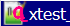

.png "Title Ą")

.png)

* url_

.png)

.png)


```
if
BaseUrl.Scheme == "file"
&& UseNonAsciiNoEscape 
i.e. fix a bug under IE/Edge with local file links containing non US-ASCII chars
then do not escape chars in URL with %

also when alt starts with "url_" then unescape input url.
```
