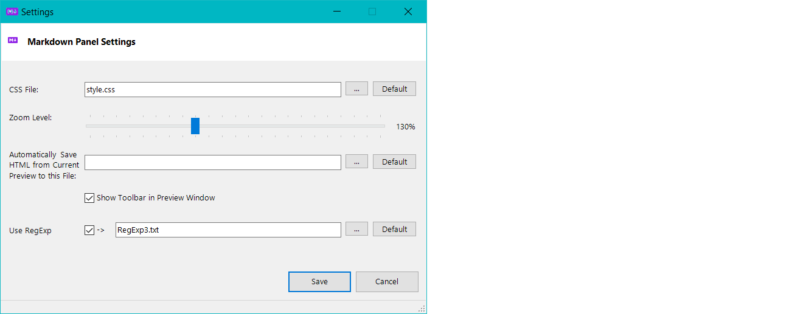
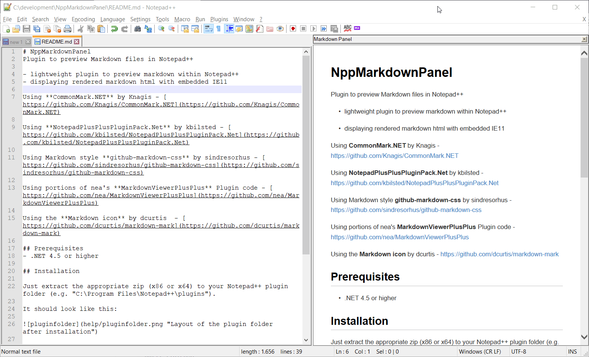

# NppMarkdownPanel
Plugin to preview Markdown files in Notepad++

- lightweight plugin to preview markdown within Notepad++
- displaying rendered markdown html with embedded IE11
- can save rendered html to a file

### Current Version

The current version is **0.5.1.3** - master branch can be found [here](https://github.com/mohzy83/NppMarkdownPanel/releases)

Branch in develop stage: <https://github.com/andrzejQ/NppMarkdownPanel/releases>
( forked from <https://github.com/UrsineRaven/NppMarkdownPanel> / forked from <https://github.com/mohzy83/NppMarkdownPanel> )

Non-ascii chars can be used in *.md path and image names (IE/Edge bug with local file links). When `![alt]` starts with "url_" then unescape input ur `(...)`



Auto-name - `.` - means current document full path name with additional ".html" extension.  
Added possibility to multiply replase source Npp text with RegExp. See "Release...\RegExp3.txt" for some config. for Jekyll markdown corrections.

"**RegExp3.txt**" should have multiply 3-lines: Comment (ignored), Pattern, ReplacementPattern for [RegExp](https://docs.microsoft.com/dotnet/standard/base-types/regular-expression-language-quick-reference). In ReplacementPattern `\r`,`\n`,`\t` can be used. Example:

````cs
    // Comment: {{ site.baseurl }} -> ..
\{\{ site\.baseurl \}\}
..
    // ....{:style -> ...{style
(\S\{):
$1
    // Jekyll front matter -> `$1$2$3` (in repl.patt.`\r`,`\n`,`\t` can be used, ex: ```\n$1$2$3\n```) 
(?i)^(---)(\s+layout:[\s\S]+?)(---)
`$1$2$3`
````

Config. file "RegExp3.txt" (and "style.css") can be placed in Notepad++\plugins\NppMarkdownPanel\ folder.

Files "RegExp3.txt" and "style.css" are re-read again only on [Save] action in Markdown Panel Setting (see `MarkdownStyleContent` and ` RegExp3lines` in "Forms\MarkdownPreviewForm.cs"):


### Used libs and icons

Using **Markdig** v 0.16.0 by xoofx - [https://github.com/lunet-io/markdig](https://github.com/lunet-io/markdig)

Using **NotepadPlusPlusPluginPack.Net** by kbilsted - [https://github.com/kbilsted/NotepadPlusPlusPluginPack.Net](https://github.com/kbilsted/NotepadPlusPlusPluginPack.Net)	

Using Markdown style **github-markdown-css** by sindresorhus - [https://github.com/sindresorhus/github-markdown-css](https://github.com/sindresorhus/github-markdown-css)

Using portions of nea's **MarkdownViewerPlusPlus** Plugin code - [https://github.com/nea/MarkdownViewerPlusPlus](https://github.com/nea/MarkdownViewerPlusPlus)

Using the **Markdown icon** by dcurtis  - [https://github.com/dcurtis/markdown-mark](https://github.com/dcurtis/markdown-mark)

## Prerequisites
- .NET 4.5 or higher 

## Installation
### Installation over Notepad++ 
The plugin can be installed over the integrated Notepad++ "Plugin Admin..".
### Manual Installation
Create the folder "NppMarkdownPanel" in your Notepad++ plugin folder (e.g. "C:\Program Files\Notepad++\plugins") and extract the appropriate zip (x86 or x64) to it.

It should look like this:


## Usage

After the installation you will find a small purple markdown icon in your toolbar.
Just click it to show the markdown preview. Click again to hide the preview.
Thats all you need to do ;)


### Settings

To open the settings for this plugin: Plugins -> NppMarkdownPanel -> Edit Settings

* #### CSS File
    This allows you to select a CSS file to use if you don't want the default style of the preview

* #### Zoom Level
    This allows you to set the zoom level of the preview

* #### Automatic HTML Output
    This allows you ot select a file to save the rendered HTML to every time the preview is rendered. This is a way to automatically save the rendered content to use elsewhere. Leaving this empty disables the automatic saving.  
    __Note: This is a global setting, so all previewed documents will save to the same file.__

* #### Show Toolbar in Preview Window
    Checking this box will enable the toolbar in the preview window. By default, this is unchecked.

### Preview Window Toolbar

* #### Save As... ()
    Clicking this button allows you to save the rendered preview as an HTML document. Default file name is current document name with ".html" extension.

### Synchronize viewer with caret position

Enabling this in the plugin's menu (Plugins -> NppMarkdownPanel) makes the preview panel stay in sync with the caret in the markdown document that is being edited.  
This is similar to the _Synchronize Vertical Scrolling_ option of Notepad++ for keeping two open editing panels scrolling together.


## Version History

### Version 0.5.1.2

- auto-name for save-as HTML

### Version 0.5.0
- change zoomlevel for the preview in settings dialog
- change css file for the markdown style
- the new settings are persistent
- open settings dialog: Plugins-> NppMarkdownPanel -> Edit Settings


### Version 0.4.0
- switched from CommonMark.Net to markdig rendering library

### Version 0.3.0
- synchronize viewer with caret position

### Version 0.2.0
- Initial release


### Feature - Synchronize viewer with caret position




## License

This project is licensed under the MIT License - see the LICENSE.txt file for details
