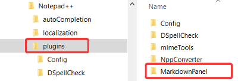
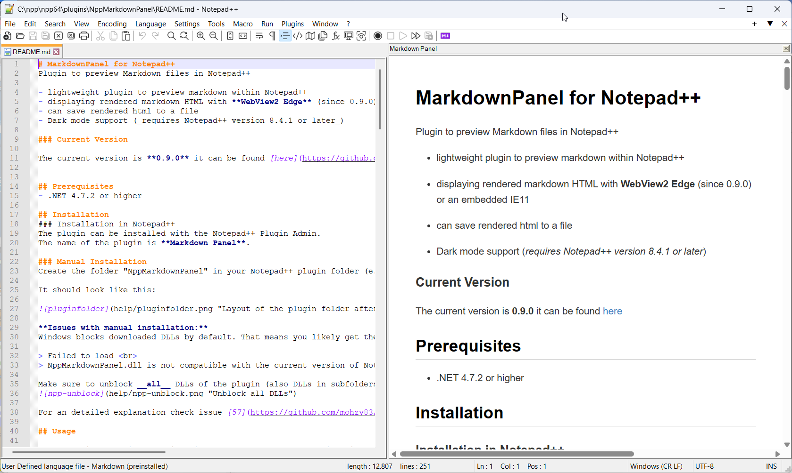
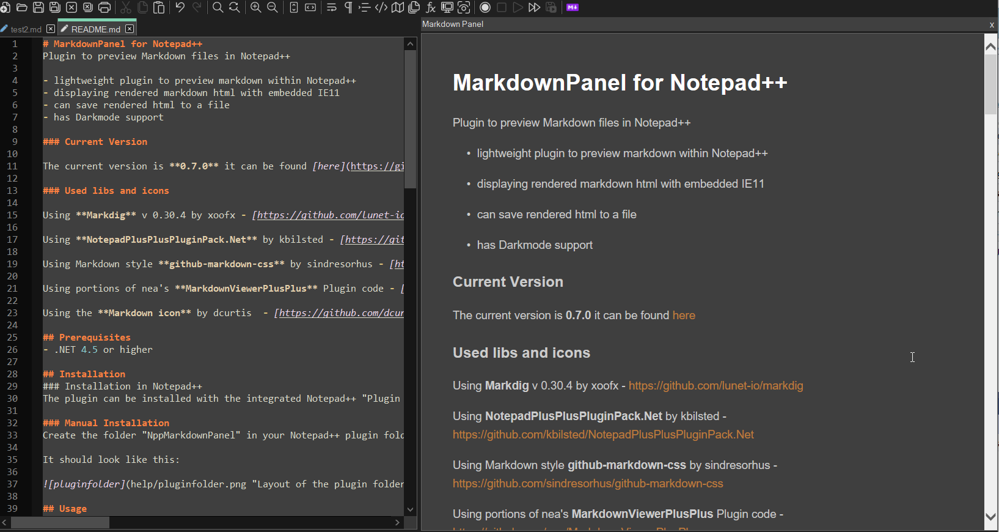
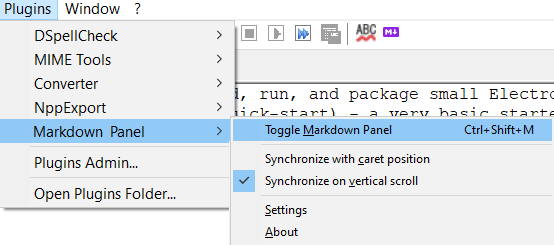
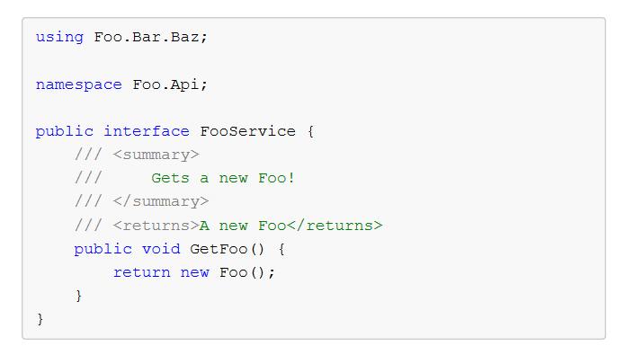

# MarkdownPanel for Notepad++
Plugin to preview Markdown files in Notepad++

- lightweight plugin to preview markdown within Notepad++
- displaying rendered markdown html with embedded IE11
- can save rendered html to a file
- Dark mode support (_requires Notepad++ version 8.4.1 or later_)

### Current Version

The current version is **0.7.3** it can be found [here](https://github.com/mohzy83/NppMarkdownPanel/releases)


## Prerequisites
- .NET 4.5.2 or higher 

## Installation
### Installation in Notepad++ 
The plugin can be installed with the Notepad++ Plugin Admin.
The name of the plugin is **Markdown Panel**.

### Manual Installation
Create the folder "NppMarkdownPanel" in your Notepad++ plugin folder (e.g. "C:\Program Files\Notepad++\plugins") and extract the appropriate zip (x86 or x64) to it.

It should look like this:



## Usage

After the installation you will find a small purple markdown icon in your toolbar.
Just click it to show the markdown preview. Click again to hide the preview.
Thats all you need to do ;)



With dark mode enabled in Notepad++:




### Settings

To open the settings for this plugin: Plugins -> MarkdownPanel -> Settings


* #### CSS File
    This allows you to select a CSS file to use if you don't want the default style of the preview
	
* #### Dark mode CSS File
	This allows you to select a Dark mode CSS file. When the Notepad++ dark mode is enabled, this Css file is used.
	When no file is set, the default dark mode Css is used.

* #### Zoom Level
    This allows you to set the zoom level of the preview

* #### Automatic HTML Output
    This allows you to select a file to save the rendered HTML to every time the preview is rendered. This is a way to automatically save the rendered content to use elsewhere. Leaving this empty disables the automatic saving.  
    __Note: This is a global setting, so all previewed documents will save to the same file.__

* #### Supported File Extensions
    This allows you to define a list of file extensions, which are supported and displayed in Markdown Panel.
	Other file type won't be displayed (there will be a warning).
	The file extensions have to be separated by a comma `,`

* #### Automatically show panel for supported files
    When this option is checked, Markdown Panel will open the preview window automatically for files with a supported extension.
	The preview will be closed for files with no supported extension.
	

* #### Show Toolbar in Preview Window
    Checking this box will enable the toolbar in the preview window. By default, this is unchecked.

* #### Show Statusbar in Preview Window (Preview Links)
    Checking this box will show the status bar, which previews urls for links. By default, this is unchecked.


### Preview Window Toolbar

* #### Save As... ()
    Clicking this button allows you to save the rendered preview as an HTML document.

### Synchronize viewer with caret position

Enabling this in the plugin's menu (Plugins -> MarkdownPanel) makes the preview panel stay in sync with the caret in the markdown document that is being edited.  
This is similar to the _Synchronize Vertical Scrolling_ option of Notepad++ for keeping two open editing panels scrolling together.

### Synchronize with first visible line in editor

When this option is enabled, the plugin ensures that the first visible line in the 
editor is also visible in the preview. (This is an alternative to _Synchronize viewer with caret position_)

## Version History
### Version 0.7.3 (released 2023-02-12)
- bug fixes
	- Settings file NppMarkdownPanel.ini isn't used anymore #78
	- Plugin release v0.7.2 searches help files in wrong directory #76
	
### Version 0.7.2 (released 2023-02-11)
- bug fixes
	- Display images with Url-encoded space character (%20) in the filename (contributed by [andrzejQ](https://github.com/andrzejQ) ) #39
- features
	- Plugin-Menu entry renamed to **MarkdownPanel**
	- Syntax highlighting is now controlled by CSS Styles. See `style.css` and `style-dark.css` after comment `/* Syntax Highlighting */` #71
	- Feature to preprocess markdown files before they are send to the converter. Furthermore it's possible to postprocess the generated html files (created by markdig). 
	To enable this feature it's necessary to configure pre/post-processor commands (can be any commandline program) in the config file `plugins/Config/NppMarkdownPanel.ini`.
	The placeholders `%inputfile%` and `%outputfile%` have to be set in the commandline and will be resolved at runtime (with temporary file names).
	An example C# commandline-project can be found under: `PPExtensions\MdpPrePostprocessorTemplate.sln`
```
[Options]
PreProcessorExe=C:\temp\preprocessor.exe
PreProcessorArguments=%inputfile% %outputfile%
PostProcessorExe=C:\temp\preprocessor\postprocessor.exe
PostProcessorArguments=%inputfile% %outputfile%
```

### Version 0.7.1 (released 2022-12-27)

- bug fixes
	- Footnotes (links to footnotes) don't work #28
	- Code fences not rendered for unknown languages (contributed by [rdipardo](https://github.com/rdipardo)) #55
	- Errorhandling when libraries are missing #57
	- Zoom label does not update on Settings panel init (contributed by [vinsworldcom](https://github.com/vinsworldcom)) #58
	- Settings dialog should render only if visible (contributed by [vinsworldcom](https://github.com/vinsworldcom)) #66
- features
	- Synchronize with first visible line in editor #14
    - Select/follow active editor pane when using mulitple editors #20
	- YAML Frontmatter is rendered as code block #46
	- Status bar to preview URLs for links (contributed by [vinsworldcom](https://github.com/vinsworldcom)) #60
	- Save As toolbar button provides default directory and filename (contributed by [vinsworldcom](https://github.com/vinsworldcom)) #61
	- Menu includes Help to access README / menu item order improved (contributed by [vinsworldcom](https://github.com/vinsworldcom)) #64
	
### Version 0.7.0 (released 2022-12-09)

- dark mode support (_requires Notepad++ version 8.4.1 or later_)
- new markdig 0.30.4 integrated
- code/syntax highlighting
	- example C# code with highlighting:

- new zoom level range from 80 % to 800% (for 4K Displays)
- all html files are saved as utf-8 files
- restrict preview to files with a specific extension
- automatically open panel for supported files
- enhanced about dialog


### Version 0.6.2 (released 2022-06-02)
Bugfix release
- viewer was crashed by too large documents (more than 10000 bytes)

### Version 0.6.1 (released 2022-05-26)
- fix embedded images
- fix dark icon

### Version 0.6.0 (released 2022-05-26)

- plugin headers for npp updated
- darkmode icon
- fixed refresh bug for 64-bit version of plugin
- new zoom level range from 40 % to 400%
- save html
- images for help file now included

### Version 0.5.0
- change zoomlevel for the preview in settings dialog
- change css file for the markdown style
- the new settings are persistent
- open settings dialog: Plugins-> NppMarkdownPanel -> Edit Settings

### Version 0.4.0
- switched from CommonMark.Net to markdig rendering library

### Version 0.3.0
- synchronize viewer with caret position

### Version 0.2.0
- Initial release

### Used libs and resources

| Name                              | Version | Authors                             | Link                                                                                                                   |
|-----------------------------------|---------|-------------------------------------|------------------------------------------------------------------------------------------------------------------------|
| **Markdig**                       | 0.30.4  | xoofx                               | [https://github.com/lunet-io/markdig](https://github.com/lunet-io/markdig)                                             |
| **NotepadPlusPlusPluginPack.Net** |   0.95  | kbilsted                            | [https://github.com/kbilsted/NotepadPlusPlusPluginPack.Net](https://github.com/kbilsted/NotepadPlusPlusPluginPack.Net) |
| **ColorCode (Portable)**          | 1.0.3   | Bashir Souid and Richard Slater     | [https://github.com/RichardSlater/ColorCodePortable](https://github.com/RichardSlater/ColorCodePortable)               |
| **Markdig.SyntaxHighlighting**    | 1.1.7   | Richard Slater                      | [https://github.com/RichardSlater/Markdig.SyntaxHighlighting](https://github.com/RichardSlater/Markdig.SyntaxHighlighting) |
| **github-markdown-css**           | 3.0.1   | sindresorhus                        | [https://github.com/sindresorhus/github-markdown-css](https://github.com/sindresorhus/github-markdown-css)             |
| **Markdown icon**                 |         | dcurtis                             | [https://github.com/dcurtis/markdown-mark](https://github.com/dcurtis/markdown-mark)                                   |

The plugin uses portions of nea's **MarkdownViewerPlusPlus** Plugin code - [https://github.com/nea/MarkdownViewerPlusPlus](https://github.com/nea/MarkdownViewerPlusPlus)


### Contributors

Thanks to the contributors: 

[vinsworldcom](https://github.com/vinsworldcom), [rdipardo](https://github.com/rdipardo), [andrzejQ](https://github.com/andrzejQ),
[RicoP](https://github.com/RicoP), [UrsineRaven](https://github.com/UrsineRaven) and
[eeucalyptus](https://github.com/eeucalyptus)

## License

This project is licensed under the MIT License - see the LICENSE.txt file for details
